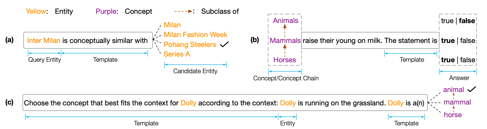

# COPEN
Dataset and code for ``COPEN: Probing Conceptual Knowledge in Pre-trained Language Models''.
COPEN is a COnceptual knowledge Porobing bENchmark which aims to analyze the conceptual understanding capabilities of Pre-trained Language Models (PLMs).
Specifically, COPEN consists of three tasks: 
- Conceptual Similarity Judgment (CSJ). Given a query entity and several candidate entities, the CSJ task requires to 
select the most conceptually similar candidate entity to the query entity. 
- Conceptual Property Judgment (CPJ). Given a statement describing a property of 
a concept, PLMs need to judge whether the statement is true. 
- Conceptualization in Contexts (CiC). Given a sentence, an entity mentioned in the sentence, and several concept chains of the entity, PLMs need to select the most appropriate concept according to the context for the entity.



Extensive experiments on different sizes and types of PLMs show that existing PLMs systematically lack conceptual knowledge and suffer from various spurious correlations. We believe this is a critical bottleneck for realizing human-like cognition in PLMs. More concept-aware objectives or architectures are needed to develop conceptual knowledgeable PLMs. 

## 1. Quick Start
The code repository is based on `Pytorch` and `Transformers`. Please use the following command to install all 
the necessary dependcies.
`pip install -r requirements.txt`

## 2. Download Datasets
The COPEN benchmark is placed on [Tsinghua Cloud](https://cloud.tsinghua.edu.cn/f/f0b33fb429fa4575aa7f/?dl=1), please use the following command to download the datasets and place them
in the propor path.
```shell
cd data/
wget --content-disposition https://cloud.tsinghua.edu.cn/f/f0b33fb429fa4575aa7f/?dl=1
unzip copen_data.zip 
mv copen_data/task1/* task1/data
mv copen_data/task2/* task2/data
mv copen_data/task3/* task3/data 
```

## 3. Pre-processing Datasets
### Probing
```shell
cd task1
python probing_data_processor.py
cd ../
cd task2
python data_processor_for_ppl.py
cd ../
cd task3
python probing_data_processor.py
cd ../
```

### Fine-tuning
```shell
python processor_utils.py task1 mc 
python processor_utils.py task2 sc
python processor_utils.py task3 mc 
```

## 4. Run 
### Probing
```shell
cd code/probing
bash task1/run.sh 0 bert bert-base-uncased
bash task2/run.sh 0 bert bert-base-uncased
bash task3/run.sh 0 bert bert-base-uncased
```

### Fine-Tuning
```shell
cd code/finetuning
cd task1/ 
bash ../run.sh 0 bert bert-base-uncased task1 mc 42
cd task2/ 
bash ../run.sh 0 bert bert-base-uncased task2 sc 42
cd task3/ 
bash ../run.sh 0 bert bert-base-uncased task3 mc 42
```
## 5. Cite
If you use this code or benchmark, please cite us:
```
```
